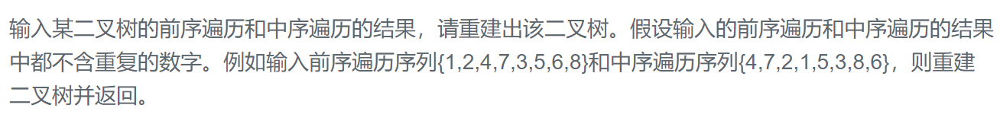

### 题目要求



### 解题思路

前序遍历和中序构建二叉树，前序和后序构建二叉树(必须左右孩子都有才能构建出二叉树)，中序和后序构建二叉树。

重点参考：[重建二叉树](https://blog.csdn.net/qq_34342154/article/details/77104202)

另外，注意非递归的解法可以后续[参考](https://leetcode-cn.com/problems/construct-binary-tree-from-preorder-and-inorder-traversal/solution/c-fei-di-gui-by-zhangxianbing-2/) 

循环解法：

整体思路是--用一个**栈保存**已经遍历过的节点，**遍历前序遍历的数组**，一直作为**当前根节点的左子树**，直到当前节点和中序遍历的数组的节点相等了(说明该节点是右子树)，那么我们正序遍历中序遍历的数组，倒着遍历已经遍历过的根节点（用栈的 pop 实现），找到最后一次相等的位置，把它作为该节点的右子树。

### 本题代码

#### 递归

```c++
class Solution {
public:
    TreeNode* reConstructBinaryTree(vector<int> pre,vector<int> vin) {
        if(pre.size() == 0 || vin.size() == 0 || pre.size() != vin.size())
            return NULL;
        map<int,int>m;
        for(int i = 0;i < vin.size();i++)
            m[vin[i]] = i;
        TreeNode* root = reconstruct(pre, 0, pre.size() - 1, vin, 0, vin.size() - 1, m);
        return root;
    }
    TreeNode* reconstruct(vector<int> pre, int pi, int pj, vector<int> vin, int ni, int nj, map<int, int>m){
        if(pi > pj)
            return NULL;
        int index = m[pre[pi]];
        TreeNode* root = new TreeNode(pre[pi]);
        root->left = reconstruct(pre, pi+1, pi + index - ni, vin, ni, index - 1, m);
        root->right = reconstruct(pre, pi + index - ni + 1, pj, vin, index + 1, nj, m);
        return root;
    }
};
```

#### 循环

```c++
/**
 * Definition for a binary tree node.
 * struct TreeNode {
 *     int val;
 *     TreeNode *left;
 *     TreeNode *right;
 *     TreeNode(int x) : val(x), left(NULL), right(NULL) {}
 * };
 */
class Solution {
public:
    TreeNode* buildTree(vector<int>& preorder, vector<int>& inorder) {
        if(preorder.size() == 0 || preorder.size() != inorder.size())
            return NULL;
        stack<TreeNode*>s;
        TreeNode* cur = new TreeNode(preorder[0]);
        int p = 1, n = 0;
        TreeNode* root = cur;
        s.push(cur);
        while(p < preorder.size()){
            if(cur->val == inorder[n]){
                while(!s.empty() && s.top()->val == inorder[n]){
                    cur = s.top();
                    s.pop();
                    n++;
                }
                cur->right = new TreeNode(preorder[p]);
                cur = cur->right;
                s.push(cur);
            }
            else{
                cur->left = new TreeNode(preorder[p]);
                cur = cur->left;
                s.push(cur);
            }
            p++;
        }
        return root;
    }
};
```

### [手撸测试](https://www.nowcoder.com/practice/8a19cbe657394eeaac2f6ea9b0f6fcf6?tpId=13&tqId=11157&tPage=1&rp=1&ru=/ta/coding-interviews&qru=/ta/coding-interviews/question-ranking)  

