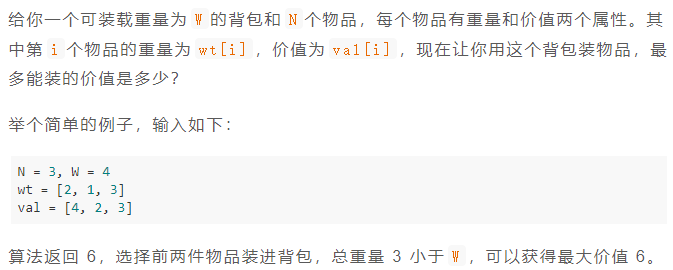

### 题目要求



### 解题思路

思路全部参考 [labuladong](https://mp.weixin.qq.com/s/RXfnhSpVBmVneQjDSUSAVQ) 大佬的思路，代码一样。明确状态和择优。`dp[i][w]`是重量为`w`时，选取`i`的最大价值。那择优就是选当前`i`和不选当前`i`的最大值：$$dp[i][w] = max(dp[i-1][w], dp[i-1][w-wt[i-1]]+val[i-1] )$$，`i`从1开始。

### 本题代码

```c++
int knapsack(int W, int N, vector<int>& wt, vector<int>& val) {
    vector<vector<int>>dp(N+1, vector<int>(W+1, 0));
    for(int i = 1;i <= N;i++){
        for(int j = 1;j <= M;j++){
            if(w - wt[i-1] <= 0)
                dp[i][w] = dp[i-1][w];
            else
                dp[i][w] = max(dp[i-1][w-wt[i-1]]+val[i-1], dp[i-1][w]);
        }
    }
    return dp[N][W];
}
```

### 01背包问题

有一个背包，容量为`sum`, 现在给你`N`个物品，第`i`个物品的重量为`nums[i - 1]`（注意 1 <= i <= N），每个物品只有一个，请问你有几种不同的方法能够恰好装满这个背包？

按照背包问题的套路，可以给出如下定义：

dp\[i][j] = x 表示，若只在前 i 个物品中选择，若当前背包的容量为 j，则最多有 x 种方法可以恰好装满背包。

翻译成我们探讨的子集问题就是，若只在 nums 的前 i 个元素中选择，若目标和为 j，则最多有 x 种方法划分子集。

根据这个定义，显然 dp\[0][..] = 0，因为没有物品的话，根本没办法装背包；dp\[..][0] = 1，因为如果背包的最大载重为 0，「什么都不装」就是唯一的一种装法。

我们所求的答案就是 dp\[N][sum]，即使用所有 N 个物品，有几种方法可以装满容量为 sum 的背包。

```c++
/* 计算 nums 中有几个子集的和为 sum */
int subsets(int[] nums, int sum) {
    int n = nums.size();
    int[][] dp = new int[n + 1][sum + 1];
    // base case
    for (int i = 0; i <= n; i++) {
        dp[i][0] = 1; //没有任何值
    }
    
    for (int i = 1; i <= n; i++) {
        for (int j = 0; j <= sum; j++) {
            if (j >= nums[i-1]) {
                // 两种选择的结果之和
                dp[i][j] = dp[i-1][j] + dp[i-1][j-nums[i-1]];
            } else {
                // 背包的空间不足，只能选择不装物品 i
                dp[i][j] = dp[i-1][j];
            }
        }
    }
    return dp[n][sum];
```

### [手撸测试](https://mp.weixin.qq.com/s/RXfnhSpVBmVneQjDSUSAVQ) 